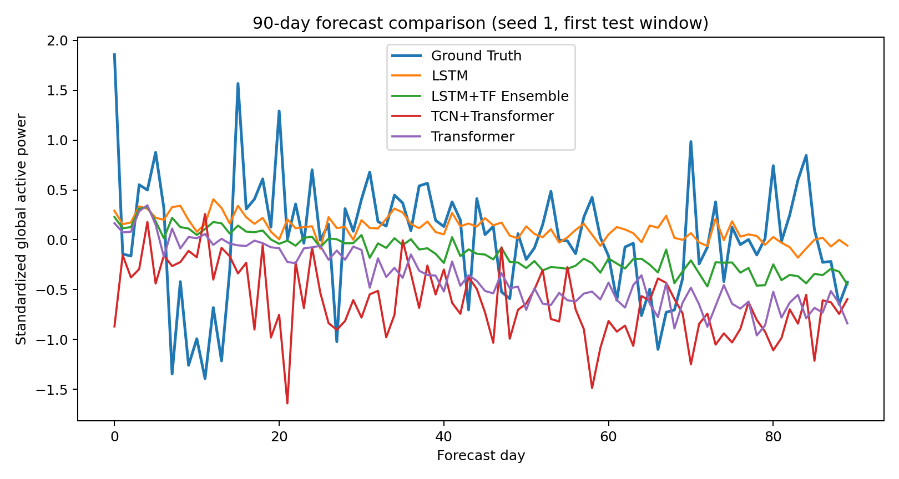
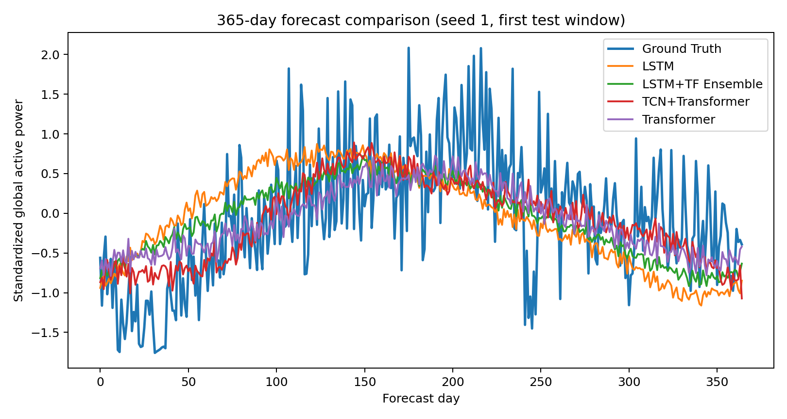

# 家庭电力消耗多步预测机器学习课程大作业

- GitHub 链接：https://github.com/ziangbuchu/ML_homework
- 数据集：UCI Machine Learning Repository, Individual household electric power consumption
- 任务：基于过去 90 天多变量电力消耗序列，预测未来 90 天和 365 天每日 `global_active_power`
- 指标：MSE 与 MAE，报告数值为标准化目标尺度上的测试集 5 个 seed mean±std
- 作者：李凡；学号：20255227122
- 说明：本报告按单人作业组织，未涉及组队贡献拆分

## 1. 问题介绍

家庭电力消耗预测是典型的多变量时间序列回归问题。给定一段历史用电观测，需要估计未来一段时间的总有功功率变化。该问题同时具有短期局部波动、周期性变化和长期趋势不确定性，因此适合比较循环神经网络、Transformer 和结构改进模型在不同预测跨度上的表现。

本项目使用 UCI 公开的 Individual household electric power consumption 数据集。原始数据为 2006-12-16 至 2010-11-26 的分钟级家庭电力观测，共 2,075,259 条记录。数据字段包括 `global_active_power`、`global_reactive_power`、`voltage`、`global_intensity`、三个 sub-metering 分量，以及由总功率和分项功率推导得到的 remainder 分量。清洗时先按分钟时间轴补齐索引，对缺失分钟做时间插值并前后填充，再聚合为 1,442 条日级样本。

实验输入窗口固定为 90 天，输出窗口分别为 90 天和 365 天。为了保证长期预测也有足够验证和测试样本，本项目按滑动窗口样本做时间顺序切分：90 天输出共有 1,263 个窗口，train/val/test 为 884/189/190；365 天输出共有 988 个窗口，train/val/test 为 691/148/149。所有模型使用同一数据流水线、同一指标定义和同一结果记录格式。

## 2. 模型

本项目实现 LSTM、Transformer 两类 baseline，并在多次尝试后采用 LSTM+Transformer Ensemble 作为最终改进模型。另保留 TCN+Transformer 作为一次结构改进尝试和负结果对照。

### 2.1 LSTM 基线

LSTM 基线将 90 天输入序列编码为隐藏状态，再用最后一个隐藏状态直接投影到完整预测窗口。该模型的优势是参数量较小、对时间顺序建模直接，适合验证在小规模日级数据上的稳健性。

```text
输入 X: [batch, 90, feature_dim]
H = LSTM(X)
z = H_last
y_hat = Linear(z) -> [batch, horizon]
```

### 2.2 Transformer 基线

Transformer 基线先将输入特征投影到 `d_model` 维空间，加入正弦位置编码，再通过 Transformer Encoder 建模日级序列中的全局依赖。Encoder 输出经过时间维平均池化后，投影为未来 90 天或 365 天预测。

```text
E = Linear(X) + SinusoidalPositionEncoding
Z = TransformerEncoder(E)
z = MeanPool(Z, time)
y_hat = Linear(z) -> [batch, horizon]
```

### 2.3 改进模型：LSTM+Transformer Ensemble

初始改进尝试为 TCN+Transformer，即在 Transformer 前加入残差 temporal convolution block，以提取局部用电波动。但正式五轮结果显示该结构在 90 天和 365 天上均未超过 baseline。进一步分析发现，LSTM 在短期预测上更稳，而 Transformer 在长期预测上更强，因此最终改进模型采用固定等权重 ensemble，直接融合两种归纳偏置。

```text
y_lstm = LSTM(X)
y_transformer = Transformer(X)
y_hat = 0.5 * y_lstm + 0.5 * y_transformer
```

ensemble 权重固定为 0.5/0.5，没有按测试集调参。脚本会加载同一 seed 下已训练的 LSTM 和 Transformer 权重，重新评估 train/val/test 三个 split，并生成 ensemble 的 `metrics.json`、`predictions_test.npz` 和预测曲线图。LSTM、Transformer 和 TCN+Transformer 训练使用 Adam 优化器，学习率 1e-3，batch size 32，最多 8 epochs，early stopping patience 3。

## 3. 结果与分析

正式实验包含 30 次神经网络训练运行，以及 10 次 ensemble 评估运行。汇总脚本从 `results/official_runs/` 收集每个 seed 的 train/val/test 指标，并生成 `results/official_summary/metrics_by_run.csv`、`results/official_summary/metrics_summary.csv` 和 `results/official_summary/report_table.md`。下表列出测试集结果。

| Model | Horizon | Test MSE mean±std | Test MAE mean±std | n |
| --- | ---: | ---: | ---: | ---: |
| LSTM | 90 | 0.461748±0.025748 | 0.528486±0.016241 | 5 |
| LSTM+TF Ensemble | 90 | 0.374844±0.021490 | 0.476894±0.012026 | 5 |
| TCN+Transformer | 90 | 0.512452±0.028040 | 0.579678±0.016588 | 5 |
| Transformer | 90 | 0.471832±0.023400 | 0.554246±0.021258 | 5 |
| LSTM | 365 | 0.499038±0.096153 | 0.550961±0.058222 | 5 |
| LSTM+TF Ensemble | 365 | 0.444566±0.034877 | 0.516384±0.022741 | 5 |
| TCN+Transformer | 365 | 0.655113±0.071301 | 0.638373±0.036456 | 5 |
| Transformer | 365 | 0.463998±0.036387 | 0.526030±0.023207 | 5 |

90 天预测中，LSTM+Transformer Ensemble 的测试 MSE 和 MAE 均最低，相比原最佳 LSTM 明显下降。LSTM 单模型仍优于 Transformer 和 TCN+Transformer，说明循环状态对短期变化建模有帮助；ensemble 进一步利用 Transformer 的补充信息降低误差。

365 天预测中，Transformer 是最强单模型，但 LSTM+Transformer Ensemble 继续取得最低测试 MSE 和 MAE。TCN+Transformer 在两个窗口上均未超过 baseline，说明局部卷积在本数据规模和训练预算下没有稳定收益，可能还增加了优化难度。



图 1 展示 seed 1 的第一个 90 天测试窗口。ensemble 曲线比单模型更平衡，整体误差最低，但局部峰谷仍有偏差。



图 2 展示 seed 1 的第一个 365 天测试窗口。长期预测更容易出现幅度收缩和趋势偏移，ensemble 在平滑趋势与局部变化之间取得了更好的折中。

## 4. 讨论

本实验支持两个有限结论。第一，在本数据集、90 天输入窗口和当前训练预算下，单模型中 LSTM 更适合 90 天短期预测，Transformer 更适合 365 天长期预测。第二，固定等权重 LSTM+Transformer Ensemble 在两个预测窗口上都取得最低 test MSE 和 MAE，因此是当前最终改进模型。

本项目的主要限制包括：指标在标准化目标尺度上计算，便于模型比较但不直接等同于原始 kW 尺度误差；滑动窗口按窗口起点时间顺序切分，相邻样本之间存在重叠；ensemble 需要同时保留 LSTM 和 Transformer 两个模型，推理成本高于单模型；数据没有额外引入天气、节假日或住户行为特征。后续改进可以尝试反标准化指标、严格按目标日期切分、学习型 ensemble 权重，以及加入季节性和外生变量。

### 参考文献

- UCI Machine Learning Repository. Individual household electric power consumption. https://archive.ics.uci.edu/dataset/235/individual+household+electric+power+consumption
- Hebrail, G. and Berard, A. Individual household electric power consumption Data Set. EDF R&D, Clamart, France, 2006-2010.
- Hochreiter, S. and Schmidhuber, J. Long Short-Term Memory. Neural Computation, 1997.
- Vaswani, A. et al. Attention Is All You Need. NeurIPS, 2017.
- Bai, S., Kolter, J. Z., and Koltun, V. An Empirical Evaluation of Generic Convolutional and Recurrent Networks for Sequence Modeling. arXiv, 2018.

### 工具辅助说明

本项目使用 ChatGPT/Codex 辅助进行代码实现、实验脚本整理、改进模型尝试和报告草稿生成。数据下载、清洗、训练、ensemble 评估和结果汇总均由本仓库脚本在本机环境中执行，报告表格与图像来自 `results/official_summary/` 中的正式实验产物。

### 复现与自检说明

完整复现步骤见 `docs/reproducibility.md`。提交前运行 `PYTHONPATH=src python scripts/verify_submission.py`，该脚本检查 PDF 可解析性、报告必需文本、关键产物存在性，以及 `lstm_transformer_ensemble` 是否在 90 天和 365 天测试集 MSE/MAE 上均为第一。

### 最终提交检查

- PDF 报告：`reports/ML_homework_report.pdf`
- 报告源稿：`reports/ML_homework_report.md`
- 复现说明：`docs/reproducibility.md`
- 提交自检：`scripts/verify_submission.py`
- GitHub 链接：https://github.com/ziangbuchu/ML_homework
- 作者：李凡；学号：20255227122；单人作业，未涉及组队贡献拆分
- 提交入口：https://docs.qq.com/form/page/DT3pqV3pNcGV6TG1z
- 截止时间：2026 年 7 月 15 日中午 12:00 前
